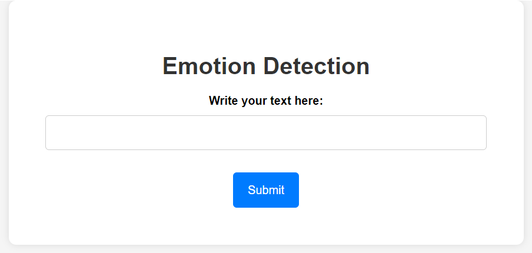
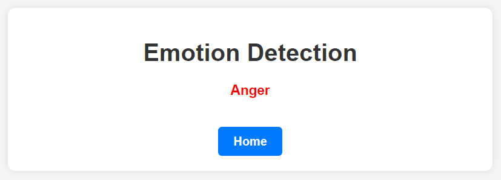

# Emotion Detection NLP Project

This repository contains the code and data for an Emotion Detection NLP project. The goal of this project is to build a machine learning model that can classify text into one of six different emotions: anger, fear, joy, love, sadness, or surprise. The project includes a Jupyter Notebook (`notebook.ipynb`) that walks through the entire process, as well as the necessary data files and a Flask web application for real-time emotion detection.

## Files

The repository includes the following files:

- `train.txt`: This file contains training data with text and corresponding emotion labels.
- `val.txt`: This file contains validation data with text and emotion labels.
- `test.txt`: This file contains test data with text and emotion labels.
- `notebook.ipynb`: Jupyter Notebook that details the data preprocessing, model training, and evaluation steps.
- `vectorizer.pkl`: A saved vectorizer used to convert text into numerical features.
- `model.pkl`: A saved machine learning model for emotion detection.
- `app.py`: A Flask web application for real-time emotion detection.
- `templates`: This directory contains HTML templates for the Flask web application, including `index.html` for the homepage and `prediction.html` for displaying predictions.

## Data

The `train.txt`, `val.txt`, and `test.txt` files contain the text data and corresponding emotion labels. The emotions are: anger, fear, joy, love, sadness, and surprise.

## Jupyter Notebook

The `notebook.ipynb` file walks through the entire process of the project, including:

1. Importing necessary libraries such as NumPy, Pandas, NLTK, and Scikit-Learn.
2. Reading and processing the text data from the provided text files.
3. Combining the validation and test data into a single dataframe.
4. Visualizing the distribution of emotions in the dataset using a histogram.
5. Performing text preprocessing steps, including text filtering, lowercasing, stopwords removal, and lemmatization.
6. Converting emotion labels into numeric values.
7. Converting text into numerical features using various techniques such as Bag of Words, TF-IDF, and Word2Vec (pre-trained models, CBOW, and Skip-gram).
8. Selecting the Bag of Words technique and performing hyperparameter tuning for optimal results.
9. Training the emotion detection model using multiple algorithms, including Random Forest Classifier, Multinomial Naive Bayes, Logistic Regression, Gradient Boosting Classifier, and Support Vector Classifier.
10. Selecting the Logistic Regression algorithm as it yields the best results.
11. Saving the Bag of Words vectorizer as `vectorizer.pkl` and the Logistic Regression model as `model.pkl` using the `pickle` library.

## Flask Web Application

The `app.py` file contains a Flask web application that allows real-time emotion detection. Users can input text, and the application will predict the corresponding emotion based on the trained model. The HTML templates in the `templates` directory are used for rendering the web pages.

## How to Use the Web App

1. Make sure you have Flask and the required libraries installed. You can install them using `pip`:

   ```bash
   pip install -r requirements.txt
   ```

2. Run the Flask app by executing the following command:

   ```bash
   python app.py
   ```

3. Access the web app in your web browser by going to `http://localhost:5000`.

4. Enter a news article's text in the provided text box and click the "Submit" button to see the prediction.

Feel free to reach out if you have any questions or need further assistance.

## Webpage Glimpse:


